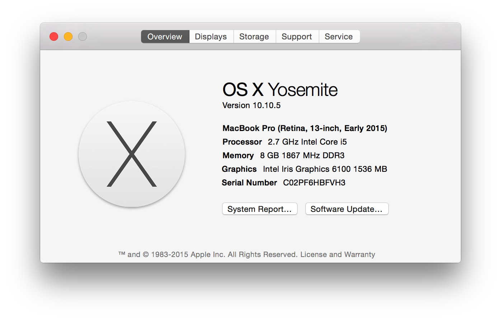

# 使用说明

## author: [yuchao86@gmail.com]

## 编译及使用方法

```
1. 编译之前请先确认安装好 libevent

2. 进入src目录直接 make;
cc    -c -o entry.o entry.c
cc    -c -o acsmx.o acsmx.c
gcc -g -o acsmx entry.o acsmx.o -levent
cc    -c -o acmf.o acmf.c
cc    -c -o util.o util.c
gcc -g -o acmf acmf.o acsmx.o util.o -levent
rm -f *.o

3. make 完成之后生成可执行文件 acmf
acmf -h 帮助信息如下：
ac-mf 0.0.1
Build-date Jun 26 2014 16:15:18
-p <file>     set ABS path(prefix), Necessarily
-f <file>     filter keywords file name
-v            show version and help
-h            show this help and exit
-H <hostname> hostname(default: 0.0.0.0)
-P <num>      listen port(default: 8668)
-t <timeout>  set HTTP timeout(default: 1)
-c [0|1]      case switch(default: 1)

4. 启动服务使用如下命令：
 ./acmf -p /root/portal/src -P 8080

注: -p 必须使用绝对路径，需要过滤的关键词表在 data 目录里面的 mf.keyword.txt 里面
需要过滤什么，自己添加，注意不要有空行。
```

##  使用实例:

接口地址：`http://yourhosts:8080`

请求方式：GET或者POST

```
参数：format=json
      word=需要检测的中文英文字符串。
返回值：error 是否等于0 等于0则成功，其他值失败。
     然后再判断数组stat是否为空，
     如果为空，则说明评论文本可以发布。
     否则不能发布。
```

### 实例1

`http://yourhosts:8080/?format=json&word=%E5%85%B1%E4%BA%A7%E5%85%9A%E5%A4%A7%E5%A3%B0%E9%81%93%E6%98%AF%E4%BB%A3%E7%90%86%E5%95%86%E7%9A%84%E7%9F%AD%E5%8F%91%E7%9A%84%E5%A4%9A%E5%B0%91Fuck%E5%85%B1%E4%BA%A7%E5%85%9Afuck%E8%A5%BF%E8%97%8F`

### 返回值

```json
{
    "error": 0,
    "stat": [
        {
            "keyword": "西藏",
            "hit_count": 1
        },
        {
            "keyword": "FUCK",
            "hit_count": 2
        },
        {
            "keyword": "共产党",
            "hit_count": 2
        }
    ]
}
```

### 实例2

`http://yourhosts:8080/?format=json&word=%E8%AF%9A%E6%8B%9B%E6%9A%91%E5%81%87%E5%85%BC%E8%81%8C%E5%B0%8F%E6%97%B6%E5%B7%A5%EF%BC%8C%E6%AF%8F%E5%A4%A9%E5%9C%A8%E7%BA%BF2.3%E5%B0%8F%E6%97%B6%EF%BC%8C%E6%97%B6%E9%97%B4%E5%9C%B0%E7%82%B9%E6%B2%A1%E9%99%90%E5%88%B6%EF%BC%8C%E6%97%A5%E8%B5%9A80-150%E5%9B%AD%EF%BC%8C%E6%9C%89%E5%85%B4%E8%B6%A3%E8%81%94%E7%B3%BBQQ%E3%80%903609027004%E3%80%91%EF%BC%8C%E6%AD%A4%E5%A4%84%E4%B8%8D%E5%9B%9E%E5%A4%8D`

### 返回值

```json
{
    "error": 0,
    "stat": [
        {
            "keyword": "联系",
            "hit_count": 1
        },
        {
            "keyword": "QQ",
            "hit_count": 2
        },
        {
            "keyword": "QQ",
            "hit_count": 2
        },
        {
            "keyword": "兼职",
            "hit_count": 1
        }
    ]
}
```

## 测试报告
### 机器配置



### 测试结果

```
$ webbench -c 500 -t 5 'http://127.0.0.1:8668/?format=json&word=sb'
Webbench - Simple Web Benchmark 1.5
Copyright (c) Radim Kolar 1997-2004, GPL Open Source Software.

Benchmarking: GET http://127.0.0.1:8668/?format=json&word=sb
500 clients, running 5 sec.

Speed=198456 pages/min, 717637 bytes/sec.
Requests: 16163 susceed, 375 failed.
```

```
$ ab -c 100 -n 10000 'http://127.0.0.1:8668/?format=json&word=sb'
This is ApacheBench, Version 2.3 <$Revision: 1663405 $>
Copyright 1996 Adam Twiss, Zeus Technology Ltd, http://www.zeustech.net/
Licensed to The Apache Software Foundation, http://www.apache.org/

Benchmarking 127.0.0.1 (be patient)
Completed 1000 requests
Completed 2000 requests
Completed 3000 requests
Completed 4000 requests
Completed 5000 requests
Completed 6000 requests
Completed 7000 requests
Completed 8000 requests
Completed 9000 requests
Completed 10000 requests
Finished 10000 requests


Server Software:        eac
Server Hostname:        127.0.0.1
Server Port:            8668

Document Path:          /?format=json&word=sb
Document Length:        57 bytes

Concurrency Level:      100
Time taken for tests:   1.633 seconds
Complete requests:      10000
Failed requests:        0
Total transferred:      2220000 bytes
HTML transferred:       570000 bytes
Requests per second:    6123.55 [#/sec] (mean)
Time per request:       16.330 [ms] (mean)
Time per request:       0.163 [ms] (mean, across all concurrent requests)
Transfer rate:          1327.57 [Kbytes/sec] received

Connection Times (ms)
              min  mean[+/-sd] median   max
Connect:        0    8  38.0      5     549
Processing:     2    8  38.7      5     549
Waiting:        1    8  38.7      5     549
Total:          5   16  54.1     10     554

Percentage of the requests served within a certain time (ms)
  50%     10
  66%     11
  75%     12
  80%     13
  90%     15
  95%     17
  98%     19
  99%    553
 100%    554 (longest request)
```
